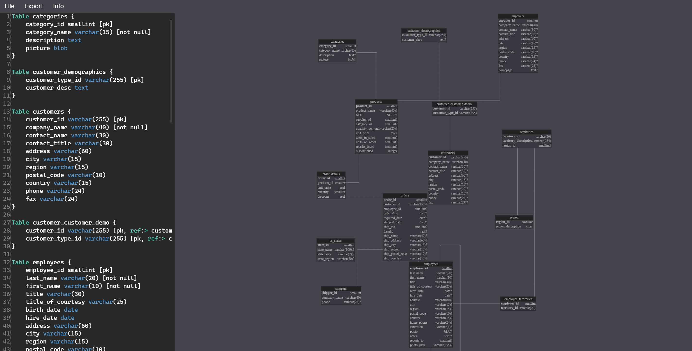

# VisualDbml

Visualization tool for [Database Markup Language](https://dbml.org).
Uses [Graphvis](https://graphviz.org/) for visualization.

Basic parsing of dbml source is working but could use a lot of optimization and cleanup.

